# Adding AI to Language Services

This is a summary of my AI work so far on the TypeScript team.
I've been looking for useful applications of AI to make it easier to write TypeScript code.
Along the way I've tried a lot of things and formed an opinion of how best to use current-generation AIs for language services.

## Value

One of my basic assumptions, informed by experience with Copilot and ChatGPT, is that a chat interface is not the best interface for coding.
It's a decent starting point for sizable, discrete tasks, but most of the time people don't break down tasks discretely in their head.
They just want help with the next step, and the next step is usually "writing code".
Fortunately, our tools are designed to make writing code easy.
It's a matter of re-packaging LLMs from their chat interface into a form that our editors can use, and that our users are familiar with: completions, refactors and code fixes, for example.

Packaged this way, LLMs complement DevDiv's existing tools quite well.
Specifically, they're good at "creative" tasks (well, generative, at least), where our tools are good at tasks with a single right answer.
<!--(This is true all the way down to single-line fixes, and the AI has a good chance of guessing right in tasks this small.)-->
But they're just generating code with no explicit reference to semantics, and no way to check its correctness.
Good news! DevDiv is full of checkers: language services, linters, test harnesses, etc.
We can automatically check LLM output in number of ways as soon as it's generated.

So my approach has been to augment our existing tools with LLMs, re-using the existing interface.
This gives our tools the appearance of creativity that they've been missing.
Then all the usual checks can be run on the output of the AI.

## Shipped Features

The first feature I implemented was AI followups to refactors and codefixes, based on a prototype by Johannes Rieken.
When Typescript runs a refactor, it can generate code that would benefit from AI editing: giving good names to things, filling in default implementations, etc.

### Implement interface

For many interfaces, implementation is boilerplate that's easy for the AI to generate.
For this fix, the AI works on the output of the Typescript language service.

| Unimplemented interface | |
|----|----|
| 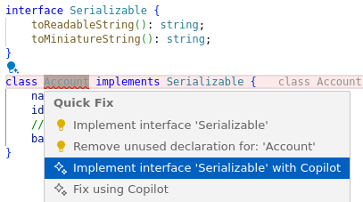 |
| Typescript output | Copilot output |
| 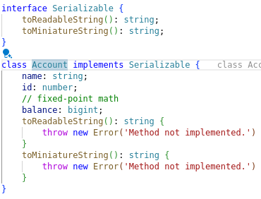 | 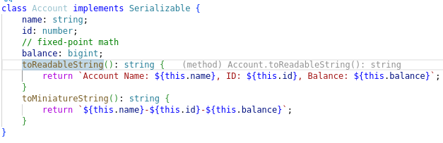 |

<!--
### Suggest meaningful names

This is an easy task as long as the names are accessible in the context window:

| Missing parameter names | |
|----|----|
| 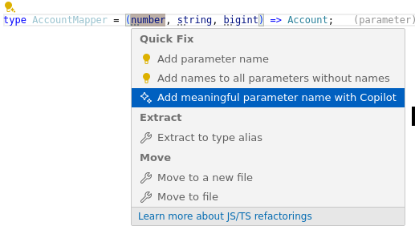 &rArr; |  |
| Typescript output | Copilot output |
| 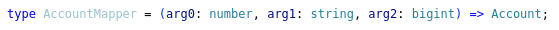 | 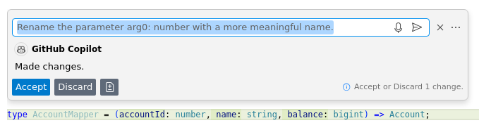 |

-->

### Infer types in untyped Typescript

This fix does not invoke the Typescript language service.
Like the language service-provided fix, the AI can fix Javascript too; it generates types in JSDoc instead of Typescript annotations.
On any of these AI followups, you can request changes, since the interface is an inline chat.

| Implicit `any` on parameters | |
|----|----|
| 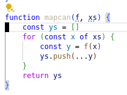 |  |
| Typescript output | Copilot output |
| 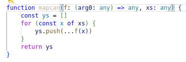 | 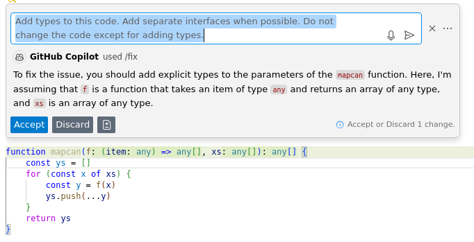 |
| | Improved Copilot output |
| | 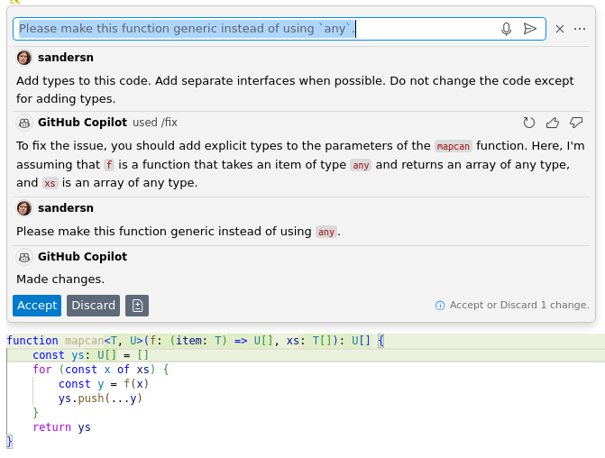 |

### Augment *Fix with Copilot* with better instructions

The ESLint rule `no-dupe-if` has a misleading error that prompts the AI to delete code.
It acts as if the only reason for duplicate `if` conditions could be that the entire code was copied twice.
In reality, it's more likely that a duplicate is an intentional copy/paste that was mistakenly not updated.

| Duplicate `if` predicates |
|----|
| 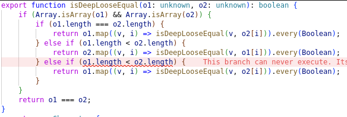 | 
| Copilot output when prompted with error | 
| 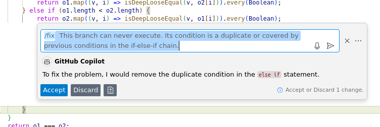 |
| Copilot output when prompted to fix instead of delete |
| 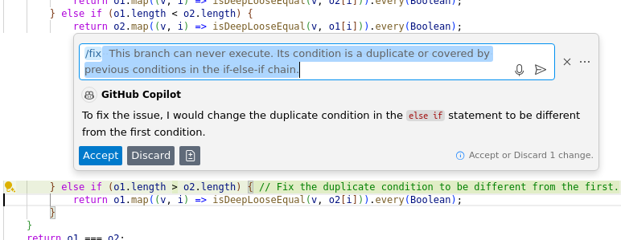 |

### Augment *Fix with Copilot* with context

*Fix with Copilot* does normally includes only context immediately around the error to be fixed.
I added the source of the currently-called function, even when it's imported from another file.
In the example below, the AI is then able to correctly swap out-of-order arguments.

| Swapped function call arguments |
|----|
| 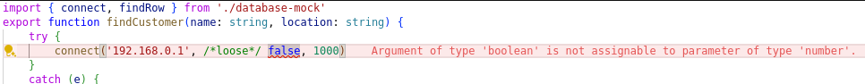 |
| Copilot output when prompted with error only | 
| 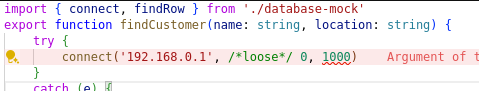 |
| Copilot output when prompted with error and `connect` source |
| 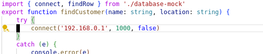 |

Both of these augmentations are powered by a JSON object literal that supports any language that VSCode does &mdash; it's as simple as adding a new entry for a language and an object literal with entries for error codes.

## Detours and Paths Not Taken

The road to those features that actually shipped had a lot of detours and wrong turns, and I got directions from a lot of people along the way.  
Here are three:

After adding AI followups to Typescript's refactors, I tried injecting the same kind of context into type inference that I later added to Typescript errors.
But it didn't help that much, so I abandoned it, justifying it by guessing that people didn't use Typescript's deterministic type inference much anyway.
When Eric Cornelson started investigating whole-file type inference with Copilot, we found that, actually, Typescript's type inference is the fourth most-used codefix.
I should have checked telemetry instead of assuming that I knew what it would say.

When I first wrote prompts to fix ESLint errors with AI, I put the code in the vscode-eslint extension.
The experiment worked, but thanks to prompting from Maria Solano (our resident ESLint expert), I moved it to the vscode-copilot extension.
It made a lot more sense in the vscode-copilot extension: it already had infrastructure to get a parse tree, for example.
The main benefit, though, was that it made language independence an obvious feature.
The data structure that holds the prompts doesn't need to be copied around between a bunch of different language's extensions this way.

Arguably, even starting with ESLint was a detour: although most lint rules are local, making them easy to fix, not many people attempt to fix them with Copilot.
This contrasts with Typescript type errors, which are usually non-local but which people try fix with Copilot a lot.
However, I didn't know this until Alexandru Dima on the vscode-copilot team showed me telemetry they've collected.
Still, I think that starting with easy errors gave me confidence that the approach was good.

## Future Work

Currently I'm adding more kinds of context to the LLM's prompt, trying to make it better at fixing bad-type-assignment errors of all kinds.
The future is to augment the prompt with correct context so that Copilot can fix any error that requires non-local information&mdash;even if the fix is not local.

It's really simple to add improved prompts, so I want to help people who own other language services improve the performance of *Fix with Copilot* for their language too.

I'd like to go back and improve type inference with additional context now that I have an idea how to do it.
And I have a list of other experiments to try.