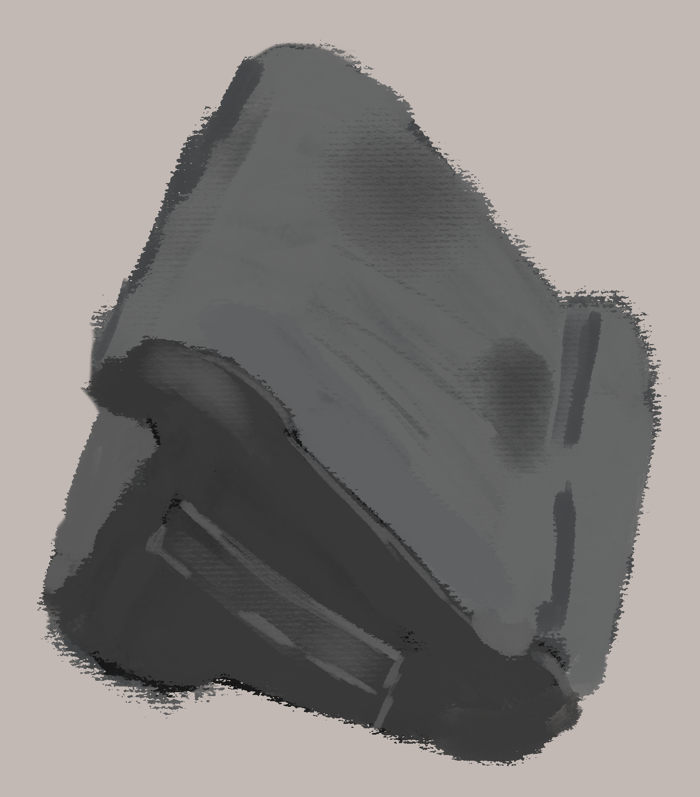
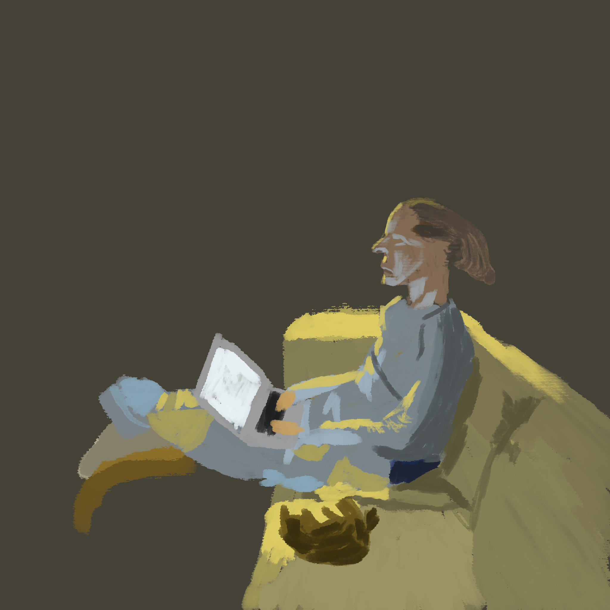
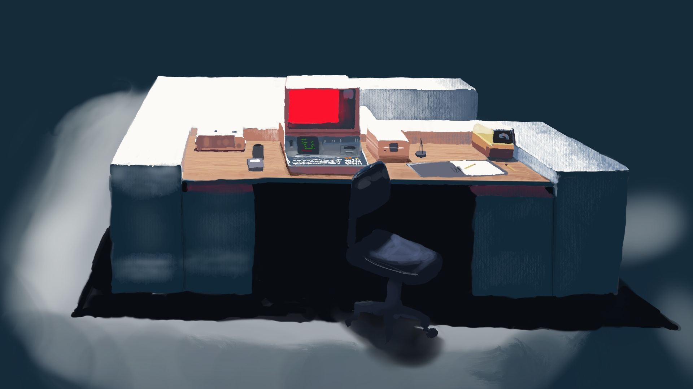
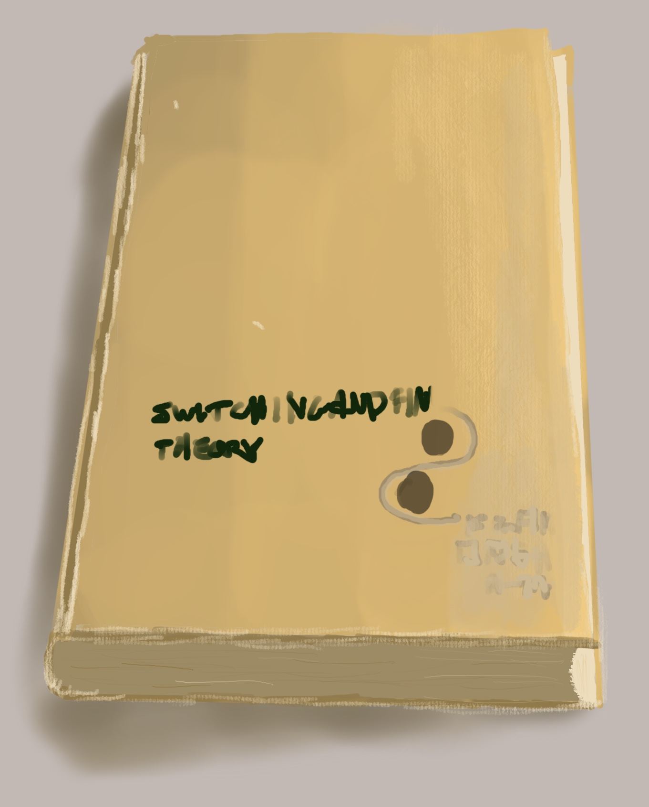
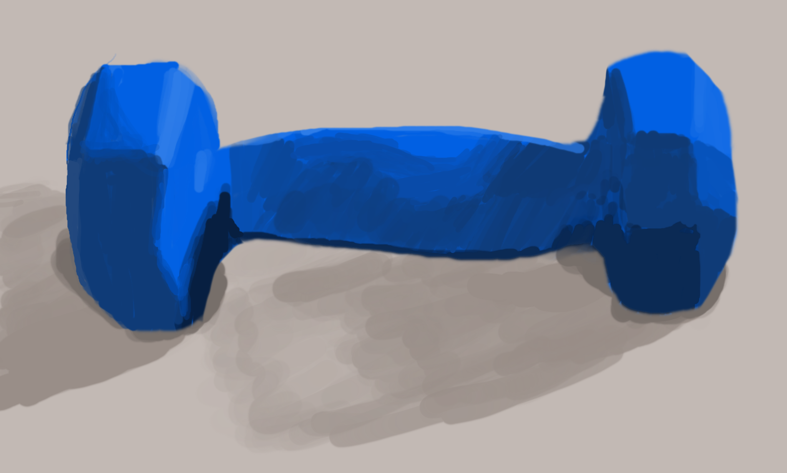
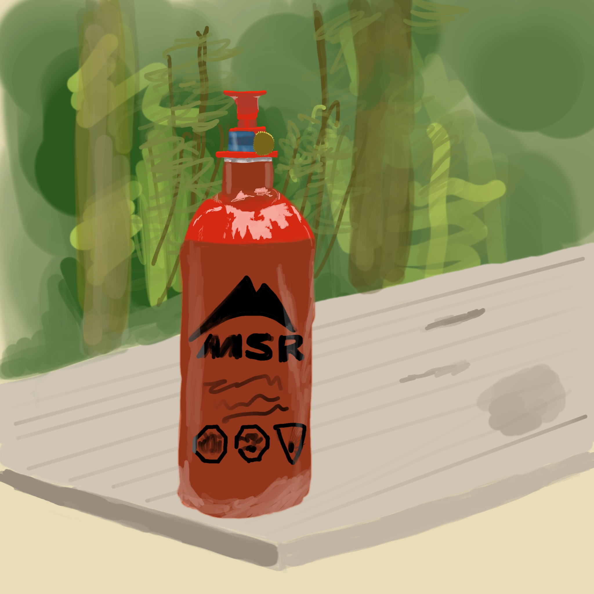
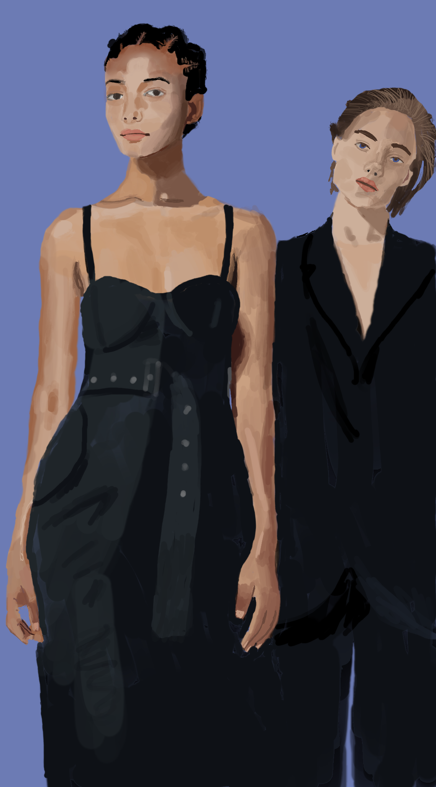
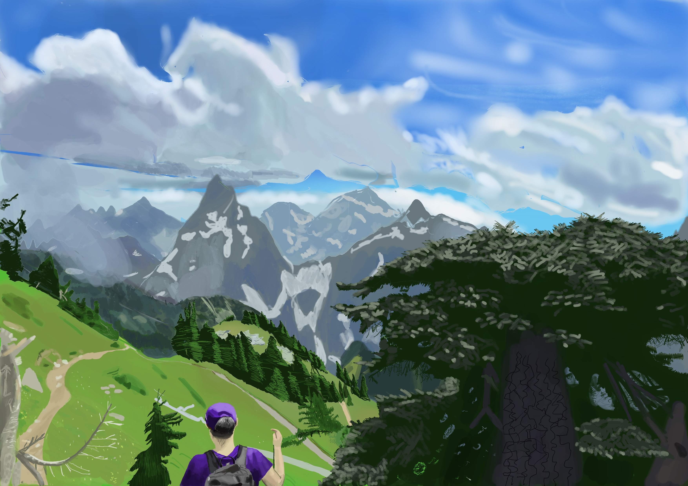

## Stairs At Night
April 2024

Perspective study

## iPad Stand
January 2024

Perspective and colour study

## Night computing
January 2024

Light study

## Majula Approach
December 2023

Dark Souls 2 is the exception that proves the rule (as in many other things). The scene is so striking and strange that the incorrect shadows don't hurt it very much.

Landscapes take me so long that I feel like my style is all over the place by the time they're done.

## Parapsychology
September 2023

Before I started painting, I thought I was going to paint my favourite video game scenes, but normal game lighting is so bad that I felt like I was teaching myself bad habits. Ray-traced global illumination changes that, and Control is one of the few that I've played with that tech. It's also full of striking scenes, although I had trouble finding one simple enough to paint.

## Waachtwoordboek
August 2023

This is a quick study of shadow, perspective and colour. Mostly colour.
The logo on the front is pretty half-hearted. I figured if AI can skimp on text accuracy, I can too.

## 5 Pounds
July 2023

This is a quick study of shadow.

## MSR
July 2023

I had a little time while camping and wanted to practise drawing from life, not from a picture. And I wanted to focus on a single object while still making a decent background. The simple shape of the bottle worked well, but I was no good at choosing colours--and I didn't use enough layers to easily change the choice afterward.

## AI_Models
June 2023

I thought it would be funny to use an AI-generated picture of models as a reference to practise drawing faces. Joke's on me: I think the faces are OK, but the rest of the picture had weird quirks that are probably the AI messing up.

## Winchester Peak Hike
May 2023

My first landscape. I bit off more than I could chew and put it down for a while, so it's pretty inconsistent. But I learned a lot!