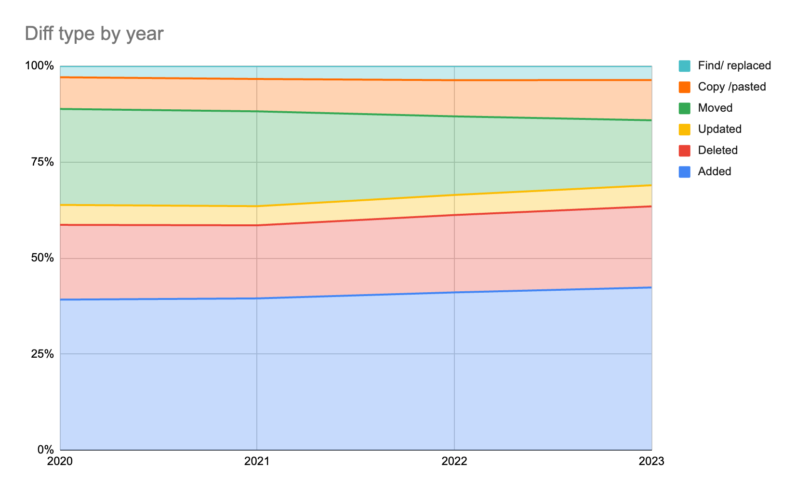
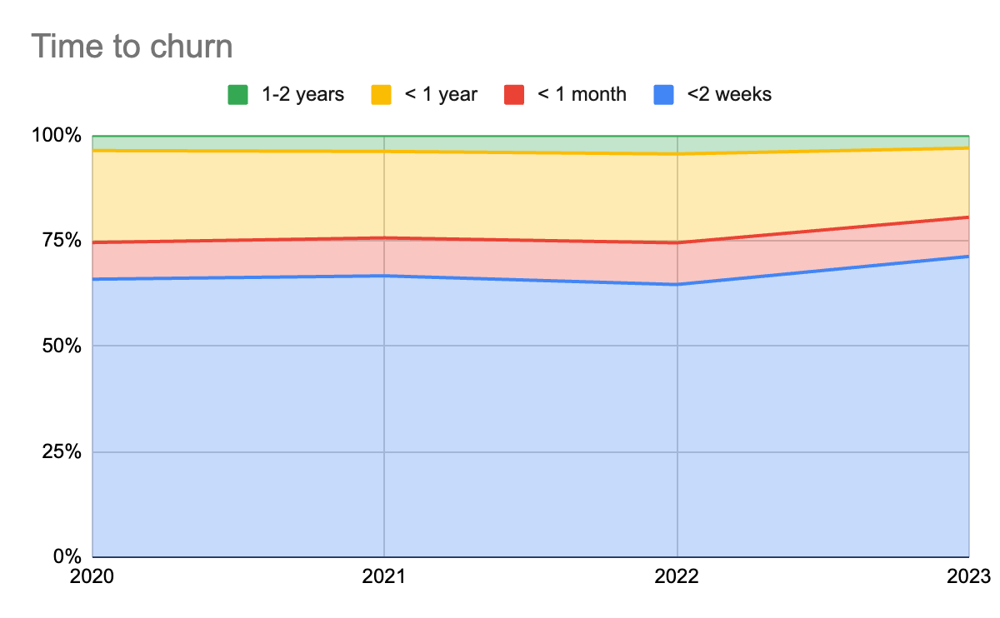
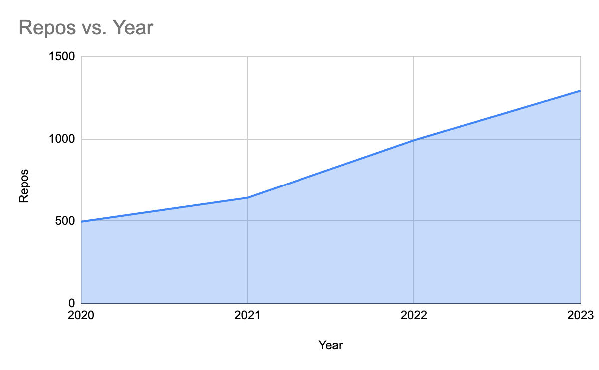
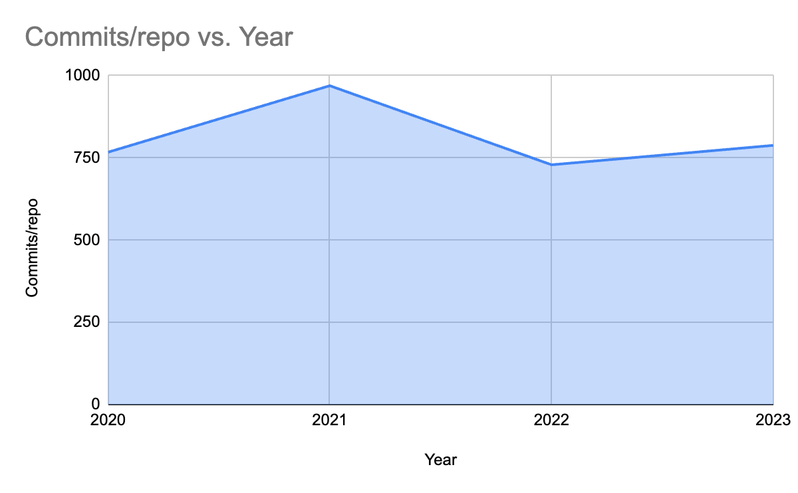
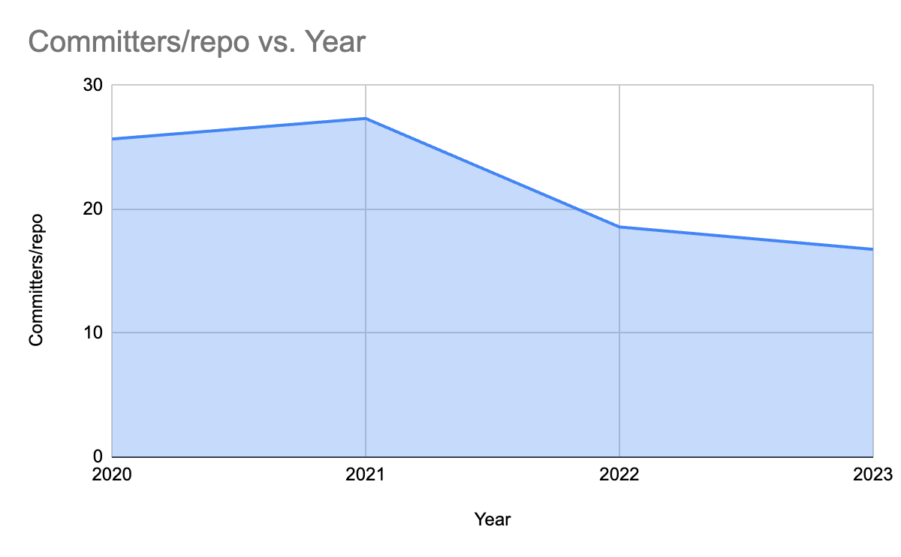

I got sucked into GitClear's *Coding on Copilot: 2023 Data Shows Downward Pressure on Code Quality* after seeing it posted on Mastodon and then talking about it with a couple of co-workers. The abstract didn't pass the sniff test so I ended up reading the whole paper. Here's the summary, plus some comments afterward.

I reordered the presentation to better match academic style, and to bring some important details up out of the appendices.

### Method
They start with almost a billion lines of diff from their customers and github data, filtered down to 153 million non-noop lines.
They classify changes into
- add
- delete
- move
- update
- find/replace (a subtype of update that only changes names)
- copy/paste

They calculate the time between a line being added and its first delete/move/update. They label a time of less than 2 weeks "churn".
Then they calculate the total lines changed.
 
### Results

- Moved code fell by 7 percentage points from 2020-2023, with add/delete and copy/paste each rising a little.
- Churn rose from 3.3% to 5.5% of total lines changed.
- Correlation between churn and estimated rates of copilot usage (2021=0%, 2022=10%, 2023=30%) is 0.98.
 
I've omitted all the 2024 projections (which, ironically, they obtained by asking chatgpt to do a regression instead of doing it themselves), and have replaced the double chart crimes with better charts that show the scale of changes.

Notably, the Time To Churn chart says that time to churn was less than 2 weeks for 65% of code in 2020, but the separate Churn value is only 3.3%. I don't know what the difference between these measures is.

### Discussion
There's a good deal of discussion about why it's bad to have less moved code and more copy/pasted code.
 
### Conclusion
They point out that github's own survey points out that developers have concerns about AI-generated-code quality.
 
## Commentary
The biggest threats to their interpretations are:

- They don't control or normalise for changes between years. There's no way to isolate AI from anything else.
- They don't test or control for any alternatives.
 
In their appendix, you can see that the number of repos and commits they use both almost triple. Any analysis that fails to normalise between years is flawed; especially if there's no attempt to control for any other causes of change. Specifically, the tech industry went through a rapid boom/bust/boom cycle in 2020-2023, where many new programmers were hired, then fired, then hired again.

For example, commits per repo is overall flat from 2020&ndash;2023 &mdash; but committers per repo goes *down*. It's just as likely that fewer programmers are working on each project as tech companies hired thousands of new employees and started them working on hundreds of new projects.

There are lots of minor problems with their discussion as well, mostly having to do with trying to bend statistics and charts to make their point stronger. This is a white paper written by a company selling code quality tools, not an academic paper.
 
### My opinions

- The most convincing point is the correlation between fast churn and (estimated) AI usage rate. The better churn chart only has a 0.8 correlation, but that's still pretty high. (Although correlation between 3 points isn't necessarily meaningful.)
- But the lack of normalisation and controls really makes all of their conclusions unusable as-is. Code quality may indeed have gotten worse since 2020. And it might be caused by Copilot. But the data presented don't show it.
- Regardless of what this study shows or not, developers are right to be cautious. Even if AI code assistants turn out to be an uncomplicated improvement, people should take care when adopting a new tool that's writing code.