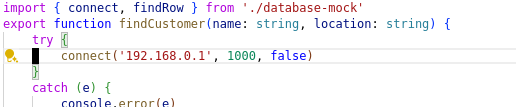

# How Does *Fix With Copilot* Work?
In VS Code, Copilot has a feature called *Fix With Copilot* that offers to fix any error in the editor with AI. It's like a code fix for every error imaginable, with the caveat that Copilot is just trying its best.

	Show an example here.
	
The Copilot extension intercepts every single error (diagnostic) that vscode gets from a language service
(TODO: Omit or find out whether it's actually subscribed to every one or if there is a generic subscription).
Then it builds a prompt that, at its core, says "There is an error with ***Error text here*** in this code ***Code here***. Please fix it."

This works well for many errors, because the error implies a fix, and the fix is simple enough for Copilot to figure out. 

## Targeted Fixes For Specific Errors
Fix With Copilot fails when the context or the error are misleading. Most errors in Typescript and ESLint, which I work with day-to-day, actually try to avoid prescribing a fix in cases where it's not obvious. That's the opposite of what Copilot needs -- if the error isn't helpful, then all it has to use is the context of surrounding code. For example, ESLint has a great rule that detects duplicate if/else predicates:

The error message suggests that the duplicate is extraneous. Which it is, from a strictly control-flow perspective. But if we stop and look at *intent*, in my experience a duplicated `if/else` or `switch case` is the result of copy/paste/modifying cases until you get enough--and then forgetting to change the last one. That's why this ESLint rule is so great, because it catches attentional mistakes. Still, the fix is to make the duplicate case *different* from the others, not to delete.

So I ask Copilot to do that, specifically for this error. I add "Fix the duplicate condition to be different from the first." to the prompt, which is enough for it to do the right thing:
	

Sometimes the error is fine, at least not actively misleading, but it just doesn't have enough context:
	

In this case there's *no way* (except blind trial and error) for you **or** Copilot to know how to fix this without looking at `connect`:

	connect source here
Once you do, the problem is obvious. The last two parameters are swapped.

-Add source (talk briefly about implementation)
-Add other calls (talk briefly about implementation)
-That's enough for anybody, even an AI that's not paying attention, to fix the problem:

## Really, how does Fix With Copilot work?
1. First, it subscribes to all errors (that are logged via a language service?). It registers a fix for Every. Single. Error. Gutsy!
2. Then, when a fix is invoked it builds a prompt using JSX with priorities.
	1. JSX is used as a text building system, nothing more. You still have components with props and state though. It's clever and stupid and perfect and over-engineered. I can't decide.
	2. Anyway it has priorities for dropping parts of the prompt when it gets too long.
	3. One component collects the code surrounding the error span.
	5. TODO: Talk about expanding the error span into the "context span".
	4. Another formats the error nicely -- and a subcomponent tries to format any related information the error contains. The features I talk about above live in another subcomponent.
	6. TODO: Talk about my subcomponents a little more. Objecty, applies to all languages, etc.
	7. Finally, before everything, the prompt does some one-shot training to explain that it wants a code sample delimited by an easy-to-parse character sequence, plus an explanation.
3. Then off to Copilot it goes. Once an answer comes back, we parse the reply into explanation and code.
4. The explanation goes to the inline chat window. This is built from standard VSCode UI elements, but the chat itself reuses the same code that the Copilot extension's side panel chat.
5. The code gets matched with the original span of the error.
6. TODO: Find out how.
7. The code gets diffed and displayed in a new-biased diff format.
8. TODO: Find out how.

#### Tasks
- Fill in pictures or gifs.
- Find a good example for base Fix With Copilot.
- Learn about the missing pieces of my knowledge in the code.
- Finish writing up the code part.
- Figure out how to mention my typescript extension work?

