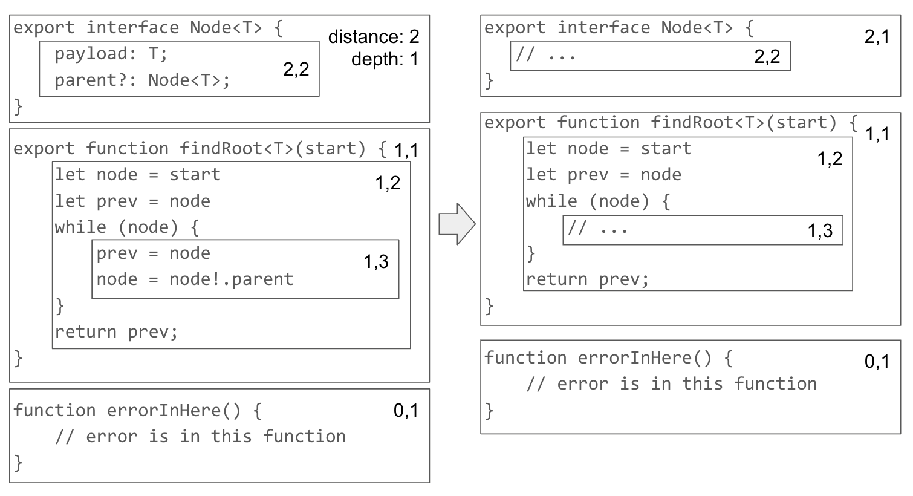

# How Does *Fix With Copilot* Work?
If you've [used Github Copilot in VS Code](https://docs.github.com/en/copilot/github-copilot-chat/using-github-copilot-chat-in-your-ide), you might have noticed that it offers a new option in the quick fix menu: *Fix With Copilot*. It's available for every error in every language.


This works well with the many excellent ESLint rules that don't have fixers for one reason or another. For example, take the ESLint rule [`no-unmodified-loop-condition`](https://eslint.org/docs/latest/rules/no-unmodified-loop-condition). It makes sure that a `while` loop body updates the variable it's checking.


There's no single way to fix this error, so ESLint doesn't have a fixer for it. But Copilot can figure out what's wrong: you should be checking `node` in the while loop, not `start`. It's the kind of silly mistake that's invisible until somebody else points it out.


	
Sometimes Copilot needs more information to fix errors. Here's another great ESLint rule: [`no-dupe-else-if`](https://eslint.org/docs/latest/rules/no-dupe-else-if). It catches if/else conditions that are duplicated by mistake. 


The rule points out a copy/paste error made by forgetting to update the third condition of three very similar conditions. When you ask Copilot for a fix, you can get the right answer because, in a recent update to its VS Code extension, we added some additional instructions to the hidden Copilot prompt.


Without a nudge in the right direction, Copilot would say that the third condition should be deleted -- after all, duplicate code is bad, right?

Another place Copilot needs help is fixing a TypeScript error when you call an imported function with bad arguments:


 In this code the last two arguments to `connect` are swapped...but there's no way to know that wihout looking at the source of `connect`. So we added the ability to look up imported functions to *Fix With Copilot*.

```ts
// in database-mock.ts
export function connect(address: string, timeout: number, loose: boolean) {
    // TODO: Actually connect
}
```

Once Copilot has the source of `connect` in the hidden prompt, the fix is easy:


## Why Does Copilot Work This Way?

So why does Copilot need this help? What happens if it's not there? Let's start by looking at how *Fix With Copilot* works at a high level.

At its core, *Fix With Copilot* is pretty simple: for any error in your code, it asks Copilot "There's an error ***\[\[Error Text Here\]\]*** in the code ***\[\[Code Here\]\]***. Can you fix it?"

This works great, in situations that LLMs are good at: a mistake that happened in the last few lines, plus an error message that explains how to fix it. But when the prompt &mdash; error message plus surrounding code &mdash; doesn't imply a clear solution, Copilot will generate an answer based mostly on its training. Even worse, if the prompt implies the *wrong* solution, Copilot will always follow along.

The bottom line is that LLMs generate text from their training based on a prompt. If the prompt contains words similar to a solution in their training, they're going to generate a good answer. To get good solutions to your specific problem, you need a prompt that *implies* a good solution.

Sometimes an error message does this: Did you tell Copilot "*'start' is not modified in this loop*"? It'll look around at 'start' in the `while` loop and compare it to patterns of `while` loops from training. Then it'll generate a fix that looks like patterns from those `while` loops.

In contrast, if you tell Copilot "*This branch can never execute.*", it'll probably find a lot of training that suggests that dead code should be deleted. But it doesn't consider intent or context. Sure, if you're writing an optimiser, dead code elimination is part of the job. But if you end up with a duplicate in an editor, it's more likely that you were copying a long series of cases and forgot to update one of them. (That's why I like the `no-dupe-else-if` rule so much. It's **always** paying attention.)


So, specifically for `no-dupe-else-if`, we nudge Copilot to update the copied code. We add "*Fix the duplicate condition to be different from the first.*" to the hidden prompt. Not only does Copilot fix the duplicate case this way, it even gives our nudge as the reason it did so:


Sometimes error messages don't actively mislead so much as fail to imply a solution. When you call a function with bad argument types, TypeScript says "*Argument of type 'boolean' is not assignable to parameter of type 'number'.*" but doesn't tell you how to fix it. That's on purpose: TypeScript has no way to know whether the call or the function itself is wrong.

Copilot would be able to guess, but *Fix With Copilot* can't even see `connect`'s code because it's imported&mdash;not in the same file. And there's no way for anybody to figure out that `connect`'s arguments are swapped without seeing the source code. So, with just the error message to go on, Copilot makes a very local change: it changes `false` to the "nearest `number` equivalent": `0`. That technically fixes the error but another immediately pops up, because it's really not a correct fix.


After we include the code for `connect` in the hidden prompt, Copilot can figure out that the arguments are swapped. That signature, `function connect(address: string, timeout: number, loose: boolean)`, strongly implies that the correct order is `timeout, loose`, not `loose, timeout`.


## But really, how does *Fix With Copilot* work?

Now that you've seen why these additional instructions and context are needed,
let's talk about how they fit into the actual implementation of *Fix With Copilot*.

The first thing *Fix With Copilot* does is register as a fix provider for every kind of file. Every single one! Then, for each document you have open, it requests errors and adds *Fix With Copilot* to the list of available fixes for each.

When you click on *Fix With Copilot*, it invokes Copilot's inline chat with a hidden prompt constructed from JSX components. JSX&mdash;but not React. Copilot has its own renderer that generates plain text from JSX components, so *Fix With Copilot*'s prompt is structured as a React-like hierarchy of small components, which is useful for organizing the different features of the prompt. As a bonus, it gives the code familiar visual ergonomics.

Here's an example of what the code looks like. `diagnostics` is the VS Code term for errors, warnings, etc. `cookbook` is the term for the per-error nudges in the form of extra instructions. `documentContext` has a reference to the current document and selection, its language, and style settings.

```tsx
diagnostics.map((d, idx) => {
    const cookbook = getFixCookbook(documentContext.language.languageId, d);
    return <>
        <DiagnosticDescription 
          diagnostic={d} 
          cookbook={cookbook} 
          showLineNumbers={this.props.showLineNumbers ?? false} 
          maxLength={LINE_CONTEXT_MAX_SIZE} 
          documentContext={documentContext} />
        <DiagnosticRelatedInfo 
          diagnostic={d} 
          cookbook={cookbook} 
          document={documentContext.document} />
        <DiagnosticSuggestedFix cookbook={cookbook} />
    </>;
})
```

What components make up the prompt? The main ones:

- Include code surrounding the error.
- Format the error nicely.
- Provide instructions to Copilot.

### Include Surrounding Code

By default *Fix With Copilot* includes the entire file around the error. Of course, most of this time the entire file won't fit in the prompt. In that case, it includes the code in current function and summarizes code outside. 

The algorithm to do this is complicated. It uses the parse tree to assign depths and distances to each block in the file. For example, the top-level `interface Node<T>` in the diagram is `distance: 2, depth: 1` from the error-containing function `errorInHere`. The body of `findRoot<T>` is `distance: 1, depth: 2`, since it's only one function above the error, but it's one down from the top level.



Once every block has a distance and a depth, each one gets a score and everything above a certain score gets abbreviated. To keep the example simple, let's just add `distance` and `depth` to get the score. Then you can see that anything with a scor above 3 is abbreviated. The body of `while (node)` was `distance:1 + depth:3` and the body of `interface Node<T>` was `distance:2 + depth:2`, so both get abbreviated.

### Format Error Message

Formatting the error starts with the error text itself, then adds a couple of sub-components: `DiagnosticRelatedInfo` and `DiagnosticSuggestedFix`.

`DiagnosticRelatedInfo` itself adds two kinds of information: the first is any related code that the error itself contains. For example, the TypeScript error  *"Duplicate declaration"* includes the duplicated declaration as related info. The second kind of information is the source of imported functions in calls with bad argument types. *Fix With Copilot* finds the source of a called function in a language-independent way, using VS Code's language service API, although right now the code only applies to TypeScript.

`DiagnosticSuggestedFix` is the 'nudge' that prompts Copilot toward a particular solution. It uses a Javascript object to map error codes to additional instructions. The type is, roughly, `Record<LanguageId, Record<string, Nudge[]>>`, where `LanguageId` is a union of supported languages. Here's a snippet of the nudges in the middle of the `"typescript:eslint"` object:

```ts
'no-dupe-else-if': [
    'Fix the duplicate condition to be different from the first.',
    'Remove the duplicate condition',
],
'no-duplicate-case': [
    {
        title: 'Change the duplicate condition to be different.',
        message: 'Do not delete the duplicate case, just fix it.',
        replaceError: true
    },
    'Remove the duplicate condition',
],
'no-duplicate-imports': 'Merge the duplicated import lines.',
```

There are couple of unfinished features that you can see here. Errors can map to multiple instructions, like `no-dupe-else-if`, and the instructions can have a visible/hidden part, like `no-duplicate-case`. Neither of those features are finished yet; currently only the first instruction gets added to the hidden prompt, and none of it is visible. 

Also, the instructions can request to replace the original error message, as `no-duplicate-case` does with `replaceError: true`. That's useful when the error message causes Copilot to do the wrong thing.

### Instructions to Copilot

Before all of this, the prompt includes [few-shot learning](https://learn.microsoft.com/en-us/azure/ai-services/openai/concepts/advanced-prompt-engineering?pivots=programming-language-chat-completions#few-shot-learning) to explain how to answer a code question, and how to format it so that the code and the explanation are clearly separated.

Then off to Copilot it goes. Once an answer comes back, we use [markdown-it](https://github.com/markdown-it/markdown-it) to parse the reply, making it easy to separate the explanation and the code. The explanation goes to the inline chat window. Meanwhile, we compare the code from Copilot's reply with the code surrounding the error using a custom diff algorithm. Finally, we show the diff using VS Code's typical diff display.

Screenshots use the *Light (Visual Studio)* theme. The ErrorLens and HoverLens extensions provide errors and hover info, respectively, at the end of the line where the cursor is.

## Tasks

- [x] Learn about the missing pieces of my knowledge in the code.
- [x] Finish writing up the code part.
- [x] Daniel's comments
- [x] Polish the writing, especially near the end.
- [x] consistency: spelling of brand names (TypeScript, eslint, vscode, Fix With Copilot)
- [x] consistency: verb tense and person. Separate I=example code, we=copilot code.
  - waffling on this. Maybe you=example code, we=copilot code.
- [x] more links to outside stuff? maybe. There aren't many dependencies.
- [x] Find a good example for base Fix With Copilot.
- [x] Take new pictures or gifs (with better cropping than the current set)
- [ ] Figure out how to mention my typescript extension work?
- [ ] add alt text
- [ ] rename file names to be in order/remove unused images

