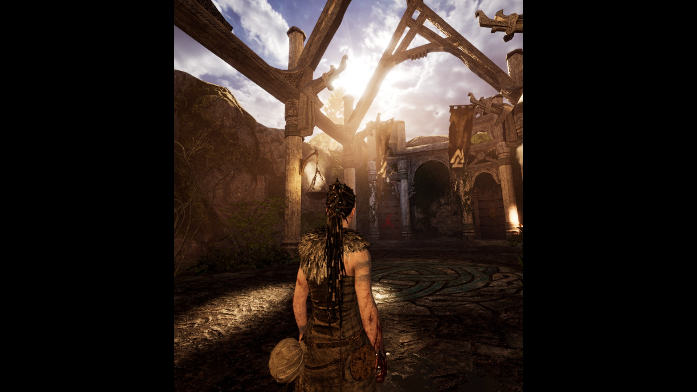
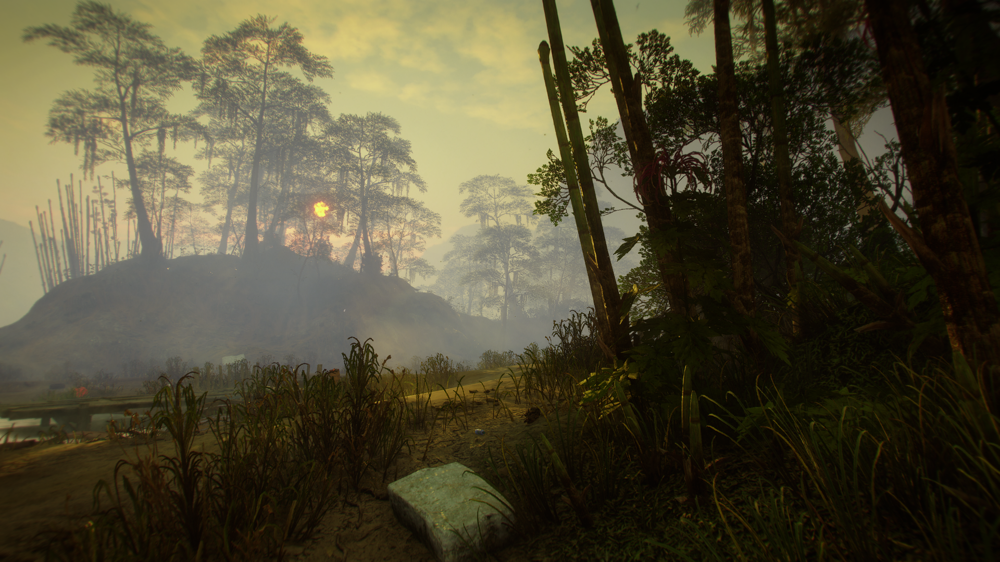
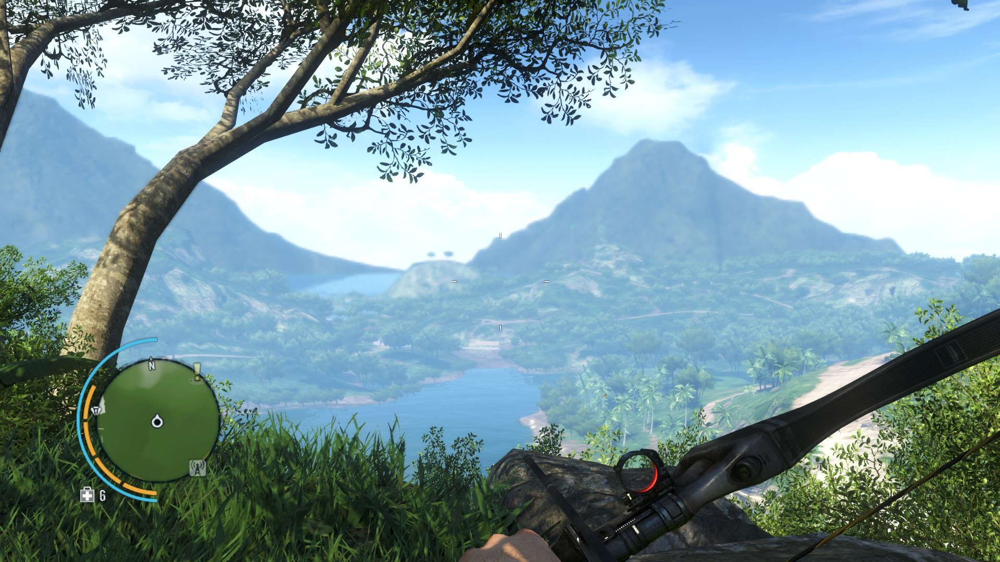
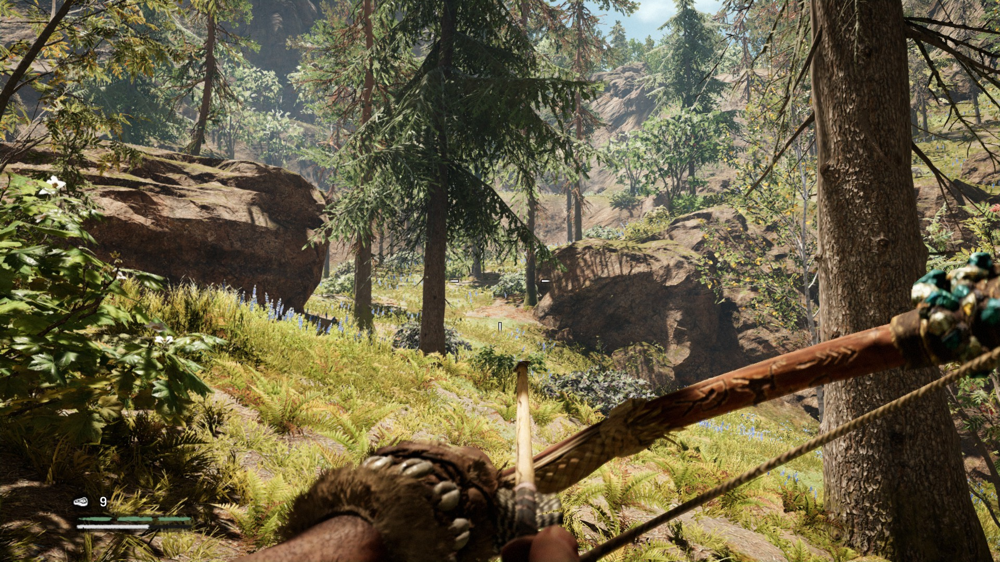

# Reviews Wave 1
Inspired by[@docsquiddy](https://twitter.com/docsquiddy)’s yearly reviews, this year I grouped games I'm playing into waves. Like Doc, I wanted to stop dropping what I was playing by mistake. Unlike him, I include games I didn’t finish (especially from Game Pass). Anyway, here's what I thought of Wave 1.
## Hellblade
Hellblade is an old-school action-adventure like Ninja Theory’s previous game, Journey to the West: better, but still 30% too long, and puzzles often killed the pace. Side note: parrying in VR is easier, maybe because of the high frame rate and improved peripheral vision. But it might also have been because of Hellblade's adaptive difficulty.

## Rage 2
Rage 2 is a great shooter (by id?) + incomplete/broken open world (by Avalanche?). The incomplete things seemed fascinating until they petered out to nothing. Even the broken graphics settings. Thinking back, this is a lot like Just Cause 3 by Avalanche. I recommend both.

## Lisa
Lisa is a “western JRPG” — think Undertale. It’s the first game on the list that I quit. I didn't even make it very far, because Lisa is intentionally hostile and depressing, both in its story and mechanics. My life at the time didn't leave any extra emotional energy for fiction.
## Creaks
Amanita is best at Adventure Game with Funny Puzzles. But Creaks is just a puzzle game. No adventure and not too funny. Double the puzzles needed for each mechanic. Only one scene where everybody on screen does a funny dance to great tunes, and it's all the way at the end.
## Yakuza 0
Yakuza 0 is a mini open world, which I liked, with a crime story, which I didn’t. I can see the appeal but they’re not for me. But I love goofy side quests, and Yakuza is full of those. I’m glad I tried it because now I get why people love these games.
## Splinter Cell: Chaos Theory
My attempt at Chaos Theory continues previous attempts at the original and Pandora Tomorrow. Splinter Cell: Chaos Theory is a less polished Metal Gear: more obviously mechanical and the levels require a single, perfect run that matches what the designer had in their head. I failed to finish it. (You’re going to see a lot of Splinter Cell attempts in these posts.)
## Far Cry 3
I replayed about the first half of Far Cry 3. Driving more this time, outposts were more spread out and smaller than I remembered. Interestingly, the in-game violence is low for the first few hours compared to the cutscenes. It helps them stand out, but they're still bad.

## Far Cry Primal
I replayed about the first 1/2 of Far Cry Primal too. I walked everywhere, the way I played Far Cry 3 the first time. The lack of guns is still noticeable: it's hard to regain control when stealth fails. Like before, I wonder why Ubisoft funds weird but bland AAA games like Primal and Assassin's Creed. And I wish I knew how accurate the world is. As a linguist, I can tell you that the made-up language sounds convincing and *way* smarter than the caveman subtitles that go with it.

## Divinity: Original Sin
Divinity: Original Sin is a D’n’D-inspired CRPG, which always feel badly paced me. So when I lost the thread of the main quest near the end of the first major area, I quit. The game has clever ideas for every individual RPG mechanic but is the same old thing overall. Not quite enough to gel into a great whole.