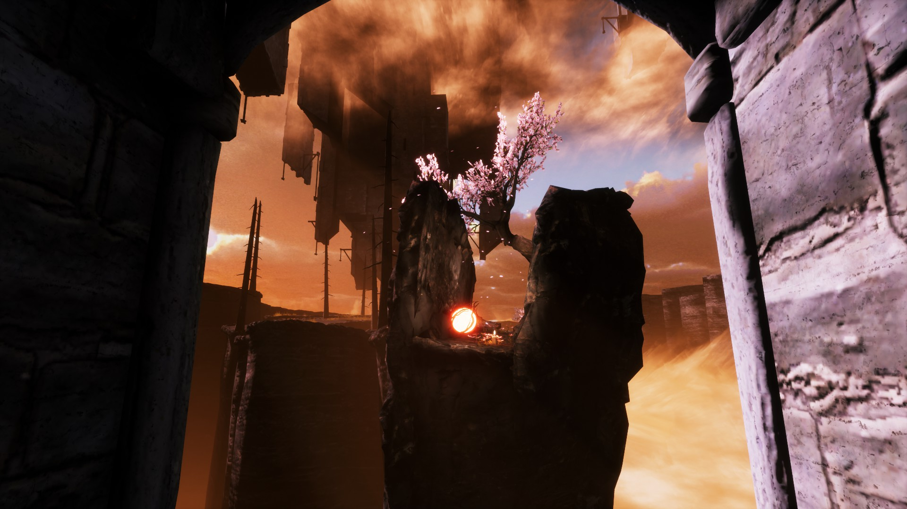
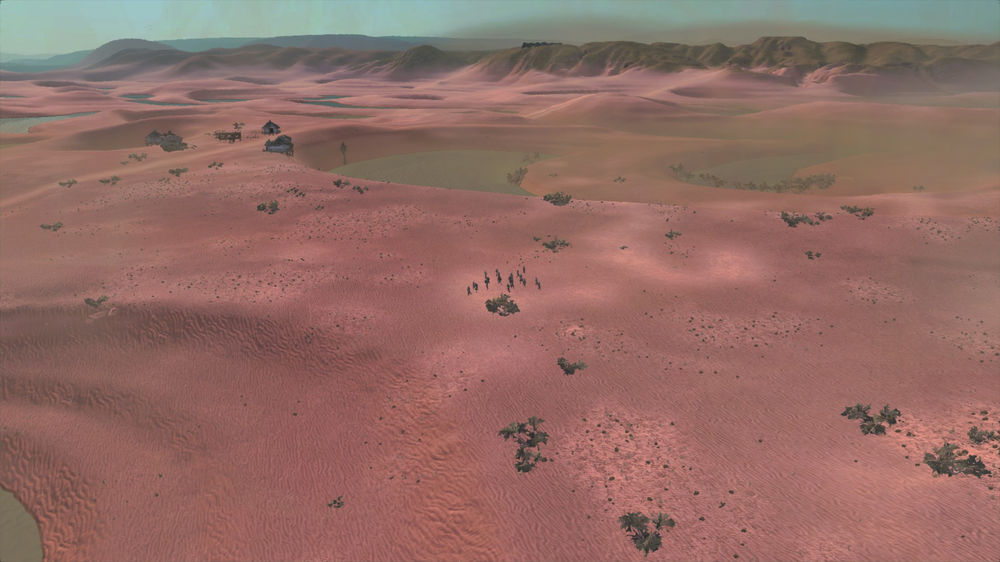
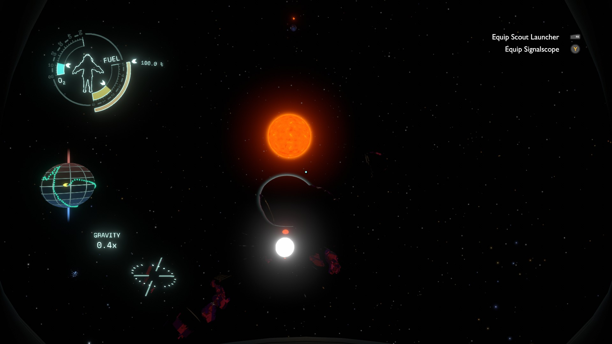

# Reviews Wave 3
Here's Wave 3 of game reviews. This was the first time in a while I played games I really liked:  I saved up strong recommendations (mostly from RPS) and bought them all in 2021 winter sales. I'd recommend Kenshi and Outer Wilds to anyone anywhere. Infernium, Gears of War, and Baba is You are worth experiencing if you haven't.
## Infernium
Infernium gloms survival horror onto a walking simulator. There are unsettling sounds and limited resources next to an unengaging story that clearly signals THIS IS ACTUALLY HELL (spoiler: it's the name of the game). Surreal vistas next to odd evasive maneuvering. Clear ideas; erratic execution. The assets feel Extremely Default Unity, but in a good way that makes me glad that anybody can make a cool game.

## Noita
Noita is an rogue-like so I treated it as a toy instead of expecting to progress anywhere. The physics simulation is very complex, but the mechanical effect is the same Minecraft or Terraria. And I never found any hilariously overpowered combos which make me stick with a rogue-like. Instead, like most right-stick-aim 2D games, I left wondering whether I would've survived a lot longer with gyro emulating a mouse.
## Kenshi

Time spent in the world of Kenshi feels real. Kenshi is a beautiful, idiosyncratic game that uses an RTS engine for a role-playing and city-building game. Almost every design decision feels like an auteur has decided that the entire world is wrong and they are right. They're wrong. And they're right. Everything *fits*.

## Baba is You
Baba is You is the cleverest block-pushing game ever -- and maybe the most principled puzzle game ever, except for the Witness. So clever. But too hard for me: most puzzle games require a horizontal insight once per section. Baba requires one on almost every puzzle. Unlike The Witness, I didn't make it all the way through. 
## Ace Combat 7
Another GB Burford recommendation, I thought it was time to try an arcade flying game. They haven't changed much since Rogue Squadron. Or maybe I haven't changed much. Great fun for the first 3-4 missions, then an impossible opponent.
The goofy story is interesting, *possibly* because it assumed you had played the first 6 games.
## Gears of War
Noah Caldwell-Gervais' next review was Gears of War, so naturally I had to play it. So many games copied its mechanics in its first decade, it doesn't feel ahead of its time mechanically. But its narrative does: it's not deep, just well-told and fun. It feels exactly as long as it ought to be. That was uncommon until recently.
## Outer Wilds
Outer Wilds is a physics simulation of space--somehow tweaked to be fun--plus weird planets to explore. Second, an unravelling mystery forms a narrative backbone. Third, it builds up to a message that hit me deep. Gears of War nails mechanics and narrative, and is a good game. Outer Wilds nails those and is also meaningful: it's great.

## Splinter Cell: Conviction
Splinter Cell: Conviction got a major overhaul from the last two games. Added: cinematic action. Removed: many fiddly commands. Most actions are context-sensitive and there's a greater emphasis on timing--and shooting. Unchanged: the requirement for pixel-perfect planning. So I didn't make it all the way through, just a bit further than last time.
## Mass Effect remake
I have three memories of Mass Effect: The sublime Star-Trek-inspired beginning, the laughably bad inventory screen, and deciding that Mass Effect 2/3 had successfully modernised the JRPG. How much of that held up? The beginning: check. The inventory screen: better (slightly). The Western-cross-JRPG: the overall story, not so much, but the individual stories are still good. The mechanics are just OK, but they were never amazing.
## Fortnite
Thanks to @JibbSmart, Fortnite added gyro controls, so I decided to give it another try. This time I played enough to appreciate what it's doing, even the bargain-bin-MMO quests. It's to give you a choice of what to do in the long gathering phase. You can vibe, gopher or chase other players. And the lack of teams means I don't have to keep up with randos. Good enough that I looked for a similar battle royale for adults, and failed.
## Lightning Returns: FF 13
Lightning Returns is so weird that I didn't get a good read on it. The intro is empty embarrassing bombast, sure. But the first chapter was burgeoning with a tutorialised mystery/visual novel/pokemon (?) ... and it was so clunky that I gave up before I could tell whether it was clunky+shallow or clunky+savoury.