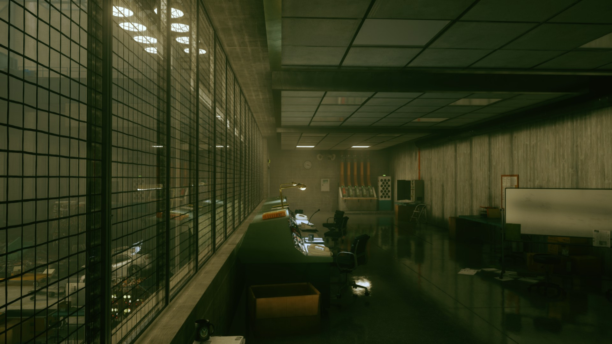
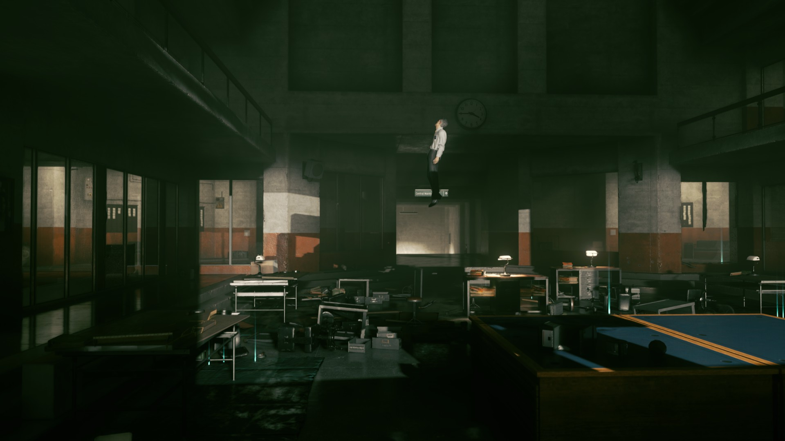
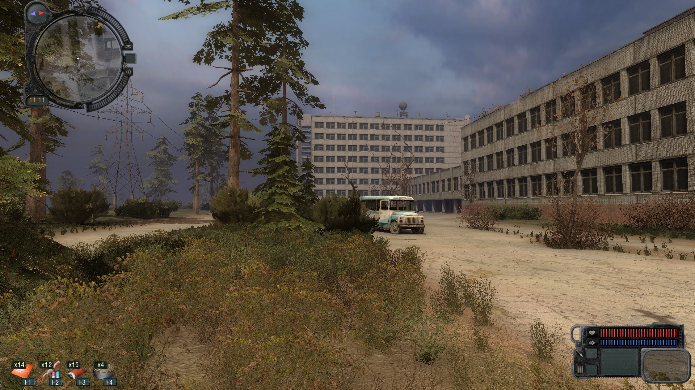
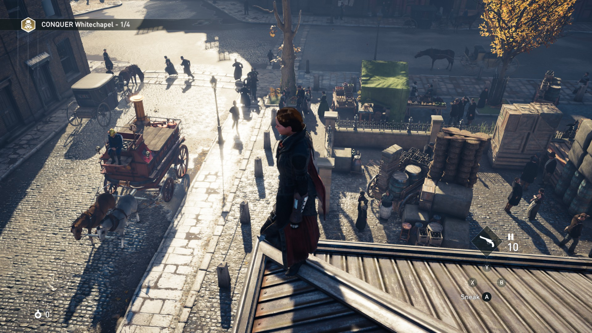
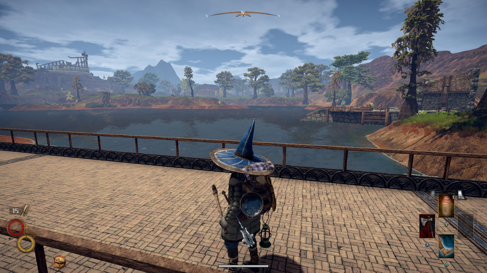
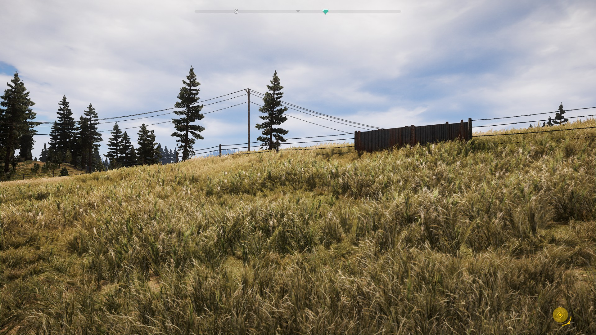

# Reviews Wave 5

This time I tried mostly games that I thought would be interesting more than fun. Which I got. Even, mostly, the AAA ones. I'd recommend Getting Over It to anybody and probably the Looker, although you don't need to finish either one to get something out of them. Control and STALKER were a good time too. (You might guess that this wave happened after the start of the Russian invasion of Ukraine.)

## Gears of War 3
Gears 3 is definitely more Gears of War. Well-crafted, slight improvement over the previous two, cleverer than it seems, and a little too consistently loud for my taste.
## Control

Control is a fun, polished narrative with decent moment-to-moment gameplay. I liked it a lot, although the weird part is: even though the modern collectible/levelling/rando-quests feel tacked on, I liked them too. Even the Metroidvania-style world feels tacked on! But Sam Lake's over-the-top, creepy-adjacent writing elevates what would otherwise be the perfect average of modern games.

## Metro 2033
Metro 2033 is a weird kind of Eurojanky: it feels like a small team imitating what they love on a shoestring--here, Call of Duty or Half-Life. But the scope is tight and the polish is high. Then again, almost every level has a broken trigger, a too-fast tutorial, or unsignposted jump. Overall, I was impressed, but frustrated a lot of the time. So, yeah, Eurojank.
## STALKER: Call of Pripyat
STALKER is classic Eurojank open-world RPG that wants to be Fallout and Witcher at the same time. Anecdote time: Some stalkers asked for help to fight some bandits at midnight. I went early, so the bandits asked me to double-cross the stalkers. Come midnight, it was pitch black, so I stumbled around until a bandit found me and thanked me for helping them win. Back at the stalker hideout next morning, I was still just as welcome there.

## The Looker
If you were curious about the Witness but didn't want to spend the time or money, the Looker is a free, short parody that will give you the flavour of it. Some of the twists are on the same level as the Witness. The main differences really are: less polish and less self-importance.
## Assassin's Creed Syndicate
Syndicate reminds me that atmosphere is the main reason I play Assassin's Creed. It's technically similar to Unity, but Victorian London just isn't as interesting. Doesn't help that the characters take the world even less seriously. Syndicate does have the best stealth in the series to dat to date! But still matched with boring level design, and surpassed by the standard-issue stealth systems of the recent games.

## Final Fantasy 14
I really *really* want to like FF14 (people I respect love it), but the game hurries you through the free part so fast now. I'm here for the atmosphere, not the plot! The rush kills the atmosphere. I'm not being allowed time to poke around ... fight 7 moose mice, or whatever.
## Outward
On my second attempt at Outward, I tried grinding and mastering the mechanics instead of exploring areas I wasn't ready for. Uh, and it didn't work. I still hit a difficulty wall a couple of hours in, and entered a downward spiral. There must be some way to prosper in this game, but I can't find it.

## Far Cry 5

Far Cry 5 starts off fine--the starter island feels like earlier Far Crys. But the game proper makes many small changes to the formula; the result is noisy and hyperactive. Also, like most Ubisoft games, the only way to stand the game is to skip every cutscene. Don't let anybody say a word.

## Getting Over It With Bennett Foddy
I did not Get Over It this time, but I got far enough to pretend I could with enough hard work. At least, I consistently got past The Devil's Chimney. (I can't remember if that's the official name or the one my kid made up.)
## Brume
Brume is very spare and short. Clearly inspired by Dark Souls and Ico, which is good, but the bad part is that "Dark Souls+Ico" tells you 90% of what you need to know.
## Rain World
Wow. Rain World is so atmospheric and fun to look at. And stressful! Very, very stressful not knowing where to hide for the night, where to find food, what will jump out at me, or whether a path will loop right back into a lion's den. I didn't make it very far.
## Spirit Hunters: Infinite Horde
I heard about Spirit Hunters from [John Walker on buriedtreasure.org](buriedtreasure.org). It's exactly Vampire Survivor, but with a more complex outer loop and less complex inner loop. It shows that the Vampire Survivor formula isn't a fluke, but neither does it advance the Survivor genre significantly.