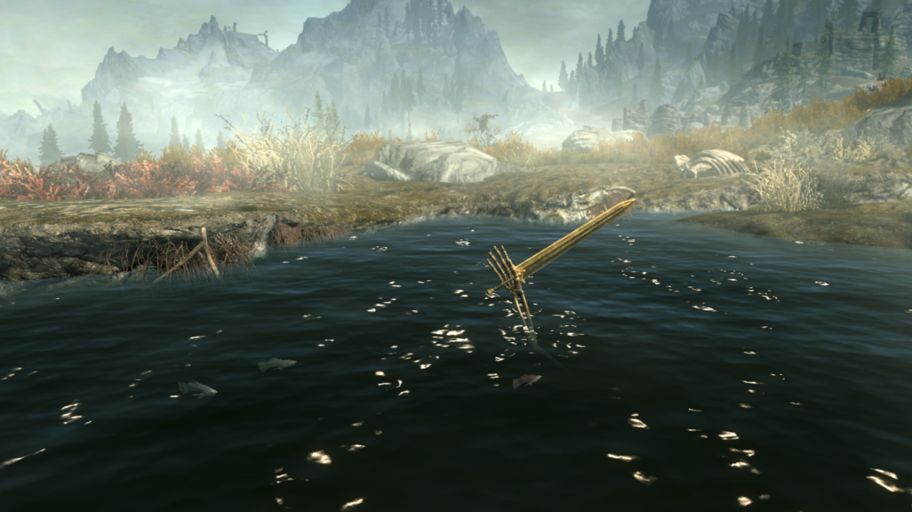

# Reviews Wave 7
Wave 7 had far too many open world games. It took up most of 2023. What can I say? That I like open world games? But it held things up quite a bit, and wave 8 isn't going any better.

I would recommend Elden Ring to anybody. There's a lot more commitment than most games, even, but if you put that in, you'll see why people have loved Dark Souls all along.
It's super long, but even more than Dark Souls proper, you don't need to play the whole thing.

You should try Subnautica for a few hours, even if it's not in VR. And Inscryption and DOOM are worth playing if you like their respective genres.

## Assassin's Creed Origins

I'm not going to justify liking Assassin's Creed at this point -- looking over my screenshots, I suspect it's at least 50% the beautiful expensive world. Within the series, I like the new direction of Origins. The newly-added Egyptian countryside complements the Alexandrian cities and ancient pyramids. The stealth is simpler, the combat is more complex, the balance is right, and the result is playable if not excellent.

Origins expands side missions out to real Side Quests and they are, without exception, bad. The side quests in Unity and Syndicate were crude in multiple ways, but there is an awful fascination in a pretend Darwin and Gladstone who gallivant around pretend-London on ridiculous excuses implemented by Assassin Creed's crusty old mechanics. Origin features famous characters I didn't recognise mixed with Anonymous Villagers. None of them got good writing.

## DOOM (2016)
What a sequel. DOOM transitions quickly from a modern corridor shooter to an updated version of the spoke-like lock-and-key design of the original. It really manages to modernise the first two games.
I'm not convinced of the value of the collectibles, but you need something to motivate exploration. DOOM 2016 copies Metroid Prime -- so you know a secret is somewhere nearby; the puzzle is in how to reach it.

Aside on controls: how is this game playable with twin-stick gamepad controls? You need to turn very fast, although precise aim isn't that important. I played with a gyro set around 7:1 and flick stick. I suspect that a normal gamepad setup has to crank the acceleration way up and the difficulty down a bit.

## Max Payne (1/2)
It was Control that sold me on Sam Lake's writing, but I like Max Payne 1 better. It's the same silly/serious feel, but completely over-the-top purple prose that falls all the way onto the side of silly. There's less craft in this first game, but that's part of the appeal.

Max Payne 2 is good too, and more polished not only in writing but also in gameplay, technology, plot and pacing. Still, if you only play one, you have to play the first one for the writing. It's quite badly balanced in the last half, but that half isn't very long.

## Elden Ring

In each new game, the Souls series tries to teach players something new about how the game is meant to be played. Previous sequels wanted to teach *existing* players something -- rolling, parrying, etc. Elden Ring wants to teach *new* players to try a Souls game. It really exaggerates the boss loop of (1) give up (2) level up (3) try again -- both for yourself and your character. Because there's no level scaling, it's a bit hollow and easy sometimes&mdash; at least if you're a returning, completionist player. But it's so worthwhile for making the series (more) accessible to people who haven't tried it before.

## Skyrim, in VR this time

Somehow, Skyrim will manage to show you a little bit that's new every little while, even after dozens of hours in the world. This despite fairly shallow mechanics, often applied uncreatively. It's strange: I can see why Morrowind is great &mdash; I'm still not sure why Skyrim is, but I'm pretty sure that it is.

With a decent headset and controllers, VR is a great way to play. Definitely more polished than the VR version of Fallout 4.

## Chorus
Chorus was disappointing. A modern take on the space shoot-em-up seems like a good idea on paper. And the moment-to-moment gameplay is fine, on its way to interesting. But: the game plods. The open world interferes with the pacing so much. I'm not sure if it was padding or trying to build tension or what. I think it is in love with its own story, so perhaps the latter.

## Subnautica
Subnautica nails 2 or 3 feelings: floating in a shallow sea--almost flying. Gazing over the edge into the depths--and realising you have to go down there. A monstrous sea creature bursting out of the dark with a roar. It also has a story and survival mechanics both of which are all right. They motivate the above feelings.

I think I don't like survival mechanics in a game with long-term goals, even purely mechanical ones. They get in the way and slow things down. That's true at least in Subnautica and No Man's Sky and Terraria and Starbound. Unless I treat survival as the entire game, I get impatient to see the rest of it.

The most recent update finally fixes the VR bugs. Just be aware that smaller vehicles may be unplayable if you have any sim sickness at all.

## Inscryption
I can't decide if I like Inscryption better than The Hex. Inscryption is more coherent and has much more polished mechanics. But the first section took me *so* long to beat, probably I never really got good at any other roguelike card games.

After that it almost becomes a .. popcorn game? Yes, there is game there, and it's good, but it's quite easy, and is subordinate to the unfolding story. Basically, I liked everything else about this game, but for my personal playthrough, the pacing was off.

Disclaimer: I *might* have missed like half the game; Daniel Mullins is so mysterious that who knows what's hidden in there.

## Redfall
I tried Redfall during a closed beta for about 6 hours. It was a minimal, technically shaky Far Cry clone then, and it sounds like that's how it shipped. There was one single area with a glimmer of Arkane level design in miniature (the theatre). One place! In an open world small enough to expect Arkane level design everywhere!

Compared against Elden Ring, which made another unlikely adaptation to an open world, it's just heart-crushing.

## Apex Legends (again)
I tried Apex Legends again. I played enough to understand two things. (1) I hate feeling like I'm slowing down my partners, or being dragged along by them. (2) The people left playing Apex are all really, really good. I kept waiting for matchmaking to put me with worse players, but I don't think it ever found any.

Also the game seemed tuned exclusively for aim-assisted controller play, which is fine but drops out a part of the FPS genre that I enjoy.

## Metroid Prime remaster
It's still Metroid Prime! I mean, it's wide-screen and high-res, but that's not really new to me since I copied all my Gamecube games over to Dolphin years ago. It's nice to have gyro controls, which makes it feel more modern, although the game is still clearly designed around lock-on + strafe using a single stick. So it's not as game-changing as in an FPS. The gyro feels less responsive and doesn't allow as high sensitivity as I'm used to on PC, though. Steam Input's recent gyro improvements have spoilt me.

But it's easy to take on vacation, so that's nice.