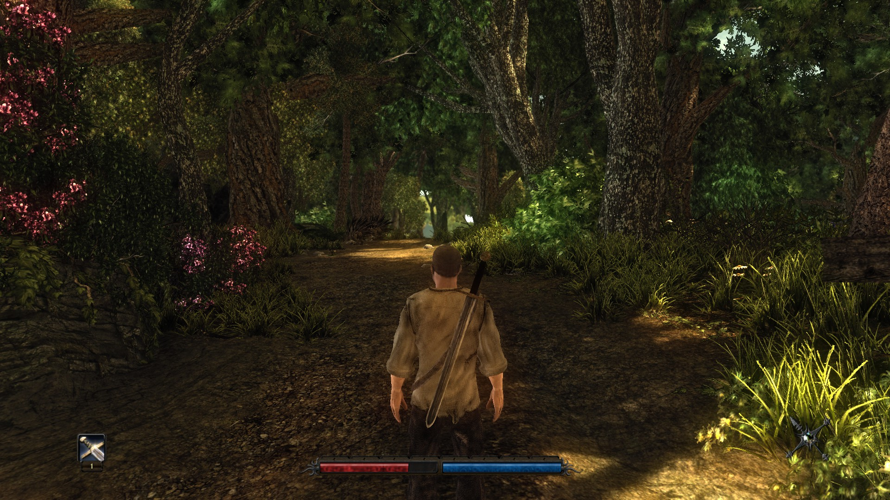
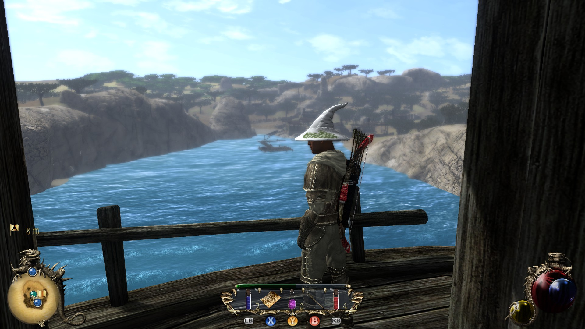
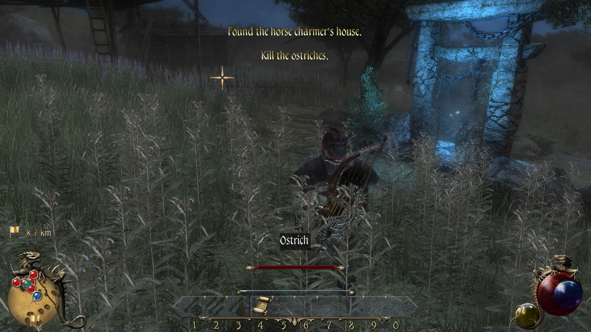
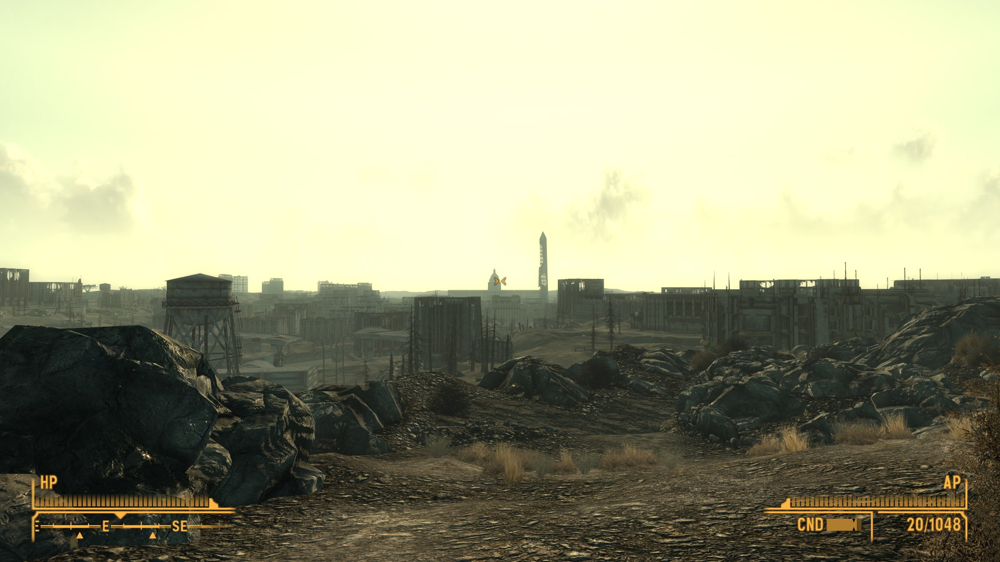
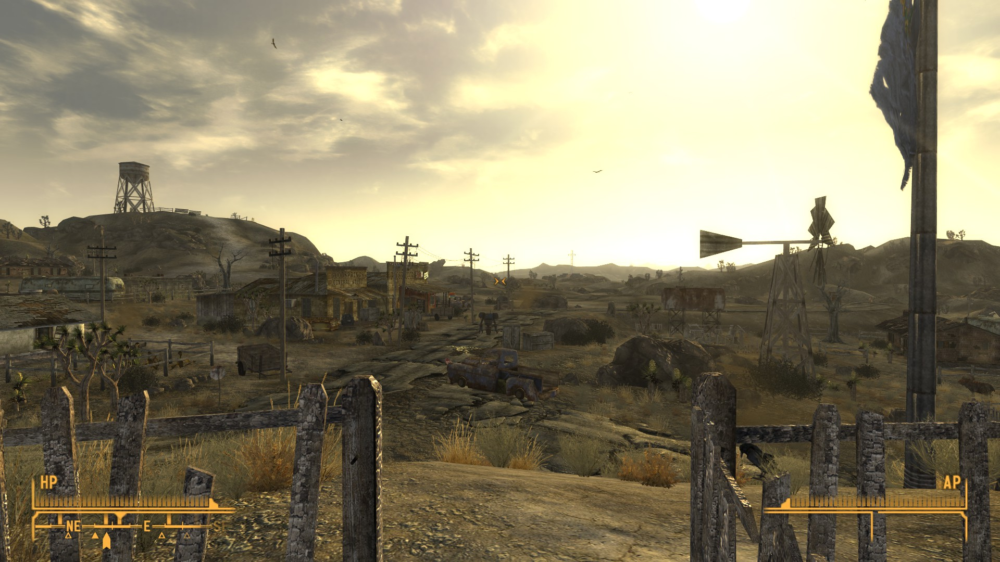

# Reviews Wave 9
Recommended: Half-Life 2, especially in VR. Streets of Rogue. Might and Magic **7** if you want to put some work into getting a game to work. Fallout New Vegas if you want to put **a lot** of work into getting a game to work. Maybe Bethesda will remake Fallout 3 so modders can make a modern New Vegas.

## Half-Life 2 VR
Half-Life 2 is amazing in VR. I've played a decent number of VR (con)versions at this point, and they re-weight and alter the emphasis of the game -- locations become awe-inspiring, or too-obviously sparse. Mechanics become harder, or nearly trivial. Half-Life 2 changes the least of any I've played. The main difference is that aiming feels harder and more exciting, but the aiming in VR has such a higher precision that it's actually about the same. Manhacks are *much* easier and satisfying to take out with swings of the crowbar.

Tip: All weapons can be held with two hands to improve their stability, but it's essential with rapid-fire. I didn't figure that one out till Episode 1, and it made me want to replay the whole thing from scratch. Again.

## Might and Magic 8
Might and Magic 8 is a tweak of the formula that Might and Magic 7 got right. It's an attempt to be interesting but none of the changes really improve things.

And: it's smaller still. 7 felt exactly the right size for a directed RPG. 8 feels a little claustrophobic in parts.
Unfortunately it also has parts that are just padded with enemies. Smaller yet padded. It's not a good combination.

Might and Magic 6/7/8 were right in the middle of skueuomorphic user interfaces, yet all 3 have different takes on it. 6 looks like a picture of some cool things, 8 looks like a drawing of some cool things, and 7 is somewhere in the middle. None of the UIs are as readable the one from 4 and 5.

## Risen

Risen asks the question, "what if we made back-and-forth talking quests the main part of the RPG, and also *really hard*?" (in the first third at least). Turns out it's super interesting! Alliances are meaningful, resources have to be scraped together, actions have a real cost. It makes you properly resent a rude NPC who refuses to help you when they're keeping you from the rest of the game.

Meanwhile, the combat is so bad that I couldn't finish the game -- it doesn't feel significantly changed from Gothic 1, which it is a sequel of in all but name. There's not a lot to show for 8 years except for improved graphics, though.

Disclaimer: Gothic and Risen are Eurojank, so they come with *significant* amounts of sexism (and blind-spot racism -- the whole game is whites-only as far as I recall).

## Two Worlds II

Ha ha, were we talking about sexist, racist Eurojank? Let me introduce Two Worlds II. Oddly compelling despite incredible jank and questionable design. The level design is just weird throughout, but especially in the design of the zones. The first one is an open savannah, extremely generic North African. The second is mostly a city plus a giant gloomy labyrinth, extremely generic East Asian. The third is a tiny haunted swamp, generic Central European.

The difficulty curve for combat is also a little off, starting hard, smoothing off after a few levels, and then spiking with each new area.

On the surface, Two Worlds *looks* like an Oblivion rip-off. Two Worlds II *looks* like a Witcher 2 rip-off. A little deeper, Two Worlds had some interesting ideas and pretty addictive systems. Two Worlds II has an overloaded life-raft of video game systems packed in there, so much that some sink below the surface. None are well explained, some seem unusable, but they're bursting with enthusiasm. You can craft your own magic, your own weapons, your own mods for weapons.

## Fallout 3/New Vegas

I remember Fallout 3 being an improved sequel to Oblivion; both lend themselves to wandering aimlessly looking to turn up interesting things. Fallout 3's were just more interesting than Oblivion's, and the mechanics were refined. In particular I remember the DC subway had the right balance of wearing grind to interesting navigation. Fallout New Vegas, on the other hand, was a little difficult at the beginning and was not at all designed for aimless spelunking. Everything was part of one story or another. I appreciated it as a game but didn't like it as much as Fallout 3.

On replay, though. Well. The more businesslike, goal-focussed way I go at replays really makes New Vegas shine whereas Fallout 3 does nothing but get in my way wasting my time. With the novelty diminished, Fallout 3 is too simple, and Fallout New Vegas' complexity is more manageable.

Side note: I also played the integrated Fallout 3/New Vegas mod of the New Vegas engine, meaning that to get to New Vegas, I had to play Fallout 3 long enough to sneak right by the US Capitol. Starting New Vegas at a decent level makes that game quite a bit easier.

## Xanadu Next
Xanadu Next is a JRPG-adjacent take on Diablo, built on the Ys engine. It's tuned to be a bit harder than Diablo's default, and there's no loot, just gold. Unfortunately, it's hard for me to describe other than "Diablo crossed with Ys." because while that may make for a *good* game, it's not an incredibly *deep* one.

## Amnesia: The Dark Descent
I don't feel qualified to talk about horror games. I only know that Amnesia is one of the classics.

I really liked the physicality of control, where you could drag windows and levers up and down with a click-and-hold. It feels like a type of design that was and still is rare, with a lineage through Ultima Underworld, System Shock and Dark Messiah of Might and Magic. Amnesia is less point and clicky than the older games, but also less precisely interactive.

## Republique
Republique spends *so* much budget on gameplay that's just a little boring. But they were designing for two new platforms in a row: first mobile, then VR.

I played the VR version, and I admit, it's an innovative attempt within the constraints of early VR: basically a transposition of 90s adventure game controls to a sneaking game. Jumping between cameras avoids movement--even most turning--and the frequent cutscenes feel like a stage play with you on the front row. The biggest failure is that sneaking a character around with point-n-click is hard to follow with the hard transitions between areas. Early Metal Gears fail in the same way, which is why later games in the series are easier and more interesting. And another reason why it's so weird to hear David Hayter in Republique as well.

## SUPERHOT VR
SUPERHOT VR is an amazing 75-second loop, a twisting, agile in-place VR shooter that still manages to be thinky. It's good enough that the first time through I wanted to see it all. This time I had fun for 75 seconds.

## Streets of Rogue
I know Streets of Rogue claims to be an "immersive sim-lite", but that's only because "immersive sim" and 2000s-era "sandbox games" are sibling genres -- it's actually more of the latter. Combining that with rogue-like is excellent, though, because it frees *my* mind enough to actually enjoy messing around with the simulation, something I don't like doing in those old sandbox games with a story and a defined character. Its main claim to "immersive sim" is that most missions involve infiltrating/exploding a building and stealing/exploding something.

Anyway you can play a zombie, gorilla or scientist, all of which have their own in-game feuds, so I'd recommend it.

## Inmost
Inmost is a fairly by-the-numbers descendant of Limbo (or Oddworld, even futher back). But it has beautiful pixel animations, snappy controls and a passable story&mdash;enough to make up for the "die here until you guess what the design was thinking" puzzles.

## Lucifer Among Us
Lucifer Among Us feels like a Western take on Phoenix Wright: more emphasis on twiddling complex UI to infer clues, less bombastic personality. The story was nice despite being predictable. But! Being predictable is a side effect of making a *lot* more sense than the Phoenix Wright cases that I can remember.

## Xenoblade Chronicles X
screenshots

Xenoblade X is a game with one really good thing about it: the open world level design. It asks, "What if getting places in the world was *actually hard*? Even modern Zelda doesn't make the world this big at the same time that so much is held back until you get better tools. But you can get *some* interesting places if you work hard early.
Everything else is mediocre to poor (though sometimes hilariously so).

## Go Home Dinosaurs
Pretty standard and boring tower defence. 